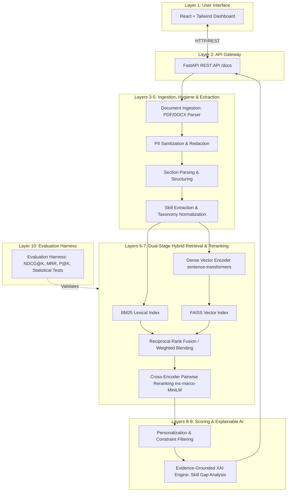

<div align="center">

# 🧠 ResumeIQ

### **AI-Powered Skill-Aware Semantic Job Search & Personalized Recommendation System**

[](https://github.com/avikengineer007/ResumeIQ-AI_Job_Recommendation_Engine/actions)
[](https://www.python.org/)
[](https://fastapi.tiangolo.com/)
[](https://react.dev/)
[](https://pytorch.org/)
[](https://github.com/facebookresearch/faiss)
[](https://www.docker.com/)
[](https://github.com/astral-sh/ruff)
[](LICENSE)

<p align="center">
  <a href="#-authors--core-research-team">Authors</a> •
  <a href="#-key-features">Key Features</a> •
  <a href="#%EF%B8%8F-system-architecture">Architecture</a> •
  <a href="#-quickstart">Quickstart</a> •
  <a href="#-api-reference">API Reference</a> •
  <a href="#-evaluation--research-protocol">Research Rigor</a> •
  <a href="#-citation">Citation</a>
</p>

</div>

---

## 👥 Authors & Core Research Team

| Author | Role | Focus Areas | Profile |
| :--- | :--- | :--- | :--- |
| **AVIK GHOSH** | **Lead System Architect & Core Engineer** | System Design, Hybrid Retrieval Pipelines, End-to-End Orchestration & Cloud Infrastructure | [](https://github.com/avikengineer007) |
| **SUMOUNA GHOSH** | **AI Research & Machine Learning Engineer** | Semantic NLP, Cross-Encoder Reranking, Skill Ontology Normalization & Explainable AI | [](https://github.com/avikengineer007) |

---

## 📌 Executive Summary

**ResumeIQ** is an enterprise-grade, research-principled AI job recommendation engine. It addresses the semantic gap in contemporary recruitment systems—where keyword matching misses transferable talents and standard dense vector similarity fails on exact technical competencies.

Given an unstructured resume (PDF or DOCX), ResumeIQ:
1. **Parses & Sanitizes**: Ingests sections while redacting Personally Identifiable Information (PII) to ensure privacy and combat hiring bias.
2. **Extracts & Normalizes Skills**: Maps extracted keywords to standardized skill taxonomies using fuzzy ontology alignment.
3. **Executes Hybrid Multi-Stage Retrieval**: Blends lexical search (**Rank-BM25**) with dense semantic embeddings (**FAISS + MiniLM**) via Reciprocal Rank Fusion (RRF).
4. **Performs Cross-Encoder Reranking**: Scores deep query-document cross-attention pairs with zero vector compression loss.
5. **Provides Evidence-Grounded Explainability**: Delivers granular skill-overlap matrices, candidate gap analyses, and interpretable recommendation rationale.

---

## 🏗️ System Architecture

The ResumeIQ engine is structured across **10 modular, decoupled layers** adhering to clean architecture principles:



### Detailed Layer Breakdown

| Layer | Component | Core Responsibilities | Technologies |
| :--- | :--- | :--- | :--- |
| **L1** | **Frontend UI** | Modern glassmorphism web dashboard, resume uploader, match explorer | React 18, Vite, Tailwind CSS, Lucide Icons |
| **L2** | **API Gateway** | Request validation, auth, rate limiting, OpenAPI specifications | FastAPI, Pydantic v2, Uvicorn |
| **L3** | **Ingestion & PII** | Resume extraction from binary formats, strict PII redaction (names, phones, emails) | `pdfplumber`, `python-docx`, Regular Expressions |
| **L4** | **Parsing & Skills** | Section segmentation (Education, Experience), skill extraction | spaCy, RapidFuzz, Curated Skill Taxonomies |
| **L5** | **Representation** | Template generation, structured candidate & job profiling | JSON-Schema, Python Dataclasses |
| **L6** | **Hybrid Retrieval** | Sparse keyword search + dense vector similarity fusion | `rank-bm25`, `faiss-cpu`, `sentence-transformers` |
| **L7** | **Cross-Encoder Rerank** | Deep bidirectional attention scoring between resume & job | `cross-encoder/ms-marco-MiniLM-L-6-v2` |
| **L8** | **Personalization** | Location, salary, seniority, and work-mode preference re-weighting | Scikit-learn, Isotonic Probability Calibration |
| **L9** | **Explainable AI (XAI)**| Evidence-grounded rationale, skill coverage breakdown, gap analysis | Deterministic Explainability Engine |
| **L10**| **Benchmark Harness** | Leakage-free split validation, ranking evaluation | NDCG@10, P@5, MRR, Paired t-tests |

---

## ⚡ Key Features

- 🛡️ **Bias-Aware & Privacy-Preserving**: Automatically scrubs contact information and sensitive demographics before recommendation processing.
- 🎯 **Dual-Stage Hybrid Search**: Combines the precision of BM25 exact keyword matching with semantic dense representations via FAISS vector indexing.
- 🔬 **Cross-Encoder Semantic Precision**: Overcomes single-vector cosine similarity limits through deep transformer pair attention.
- 💡 **Actionable Skill Gap Insights**: Not just a score—candidates receive clear visibility into missing skills and learning paths.
- 🚀 **Cloud-Native & Production-Ready**: Preconfigured with multi-stage Docker builds, PostgreSQL migration scripts, and CI/CD pipelines.

---

## 🚀 Quickstart

### Prerequisites
- Python 3.11+
- Node.js 18+ (for frontend development)
- Docker & Docker Compose (optional, for containerized run)

---

### Option 1: Quickstart with Docker Compose (Recommended)

Run the full stack (FastAPI Backend + PostgreSQL + Database Seeds) with a single command:

```bash
# Clone the repository
git clone https://github.com/avikengineer007/ResumeIQ-AI_Job_Recommendation_Engine.git
cd ResumeIQ-AI_Job_Recommendation_Engine

# Copy environment variables
cp .env.example .env

# Build and start services
docker compose up -d --build
```
- **API Documentation**: [http://localhost:8000/docs](http://localhost:8000/docs)
- **Health Check**: [http://localhost:8000/health](http://localhost:8000/health)

---

### Option 2: Local Development Setup

#### 1. Backend Setup
```bash
# Create and activate virtual environment
python -m venv .venv
source .venv/bin/activate       # On Windows: .venv\Scripts\activate

# Install dependencies
pip install --upgrade pip
pip install -r requirements.txt

# Run database migrations
alembic upgrade head

# Start FastAPI development server
uvicorn api.main:app --reload --host 0.0.0.0 --port 8000
```

#### 2. Frontend Setup
```bash
cd frontend
npm install
npm run dev
```
Visit `http://localhost:5173` in your browser.

---

## 🧪 Testing & Code Quality

ResumeIQ maintains strict code quality and test coverage standards:

```bash
# Run Ruff linting and format checking
ruff check src api tests
black --check src api tests

# Execute full test suite
pytest tests/ -v --cov=src --cov-report=term-missing
```

---

## 📡 API Reference

Interactive OpenAPI documentation is hosted at `/docs`.

### Key Endpoints

| Method | Endpoint | Description |
| :--- | :--- | :--- |
| `GET` | `/health` | System health check and model loading status |
| `POST`| `/api/v1/recommend/file` | Upload resume (`.pdf`, `.docx`) & receive recommendations |
| `POST`| `/api/v1/recommend` | Submit structured candidate profile for matching |
| `GET` | `/api/v1/jobs` | Paginated search of indexed jobs |
| `GET` | `/api/v1/jobs/{id}` | Retrieve complete job metadata & required skill vector |

#### Sample Recommendation Request (cURL)
```bash
curl -X POST "http://localhost:8000/api/v1/recommend/file" \
  -H "accept: application/json" \
  -H "Content-Type: multipart/form-data" \
  -F "file=@sample_resume.pdf" \
  -F "top_k=5"
```

---

## 🔬 Evaluation & Research Protocol

To guarantee methodological integrity and prevent publication bias:
- **Strict Separation of Splits**: Resumes and candidate queries are partitioned deterministically (60% Train / 20% Validation / 20% Test) with strictly no overlap.
- **Independent Evaluation Labels**: Quantitative benchmarks are evaluated against independently annotated query-document judgments (QRELS).
- **Metric Standards**: Retrieval and reranking performance are assessed using **NDCG@5**, **NDCG@10**, **Mean Reciprocal Rank (MRR)**, and **Precision@K**.

---

## 📁 Repository Structure

```
ResumeIQ-AI_Job_Recommendation_Engine/
├── .github/                      # CI/CD workflows, issue templates, PR checklists
│   ├── workflows/ci.yml          # Automated linting & test pipeline
│   └── workflows/deploy.yml      # Deployment automation
├── api/                          # FastAPI application
│   ├── main.py                   # Gateway entry point & route registration
│   ├── routers/                  # Modular API endpoints
│   └── schemas/                  # Pydantic v2 validation contracts
├── configs/                      # Centralized configuration YAMLs
├── data/                         # Datasets & benchmark splits
│   ├── raw/                      # Unprocessed resume & job corpora
│   ├── interim/                  # Cleaned and parsed intermediate formats
│   └── processed/                # Normalized skill indices and embeddings
├── database/                     # PostgreSQL schema definitions & migrations
├── frontend/                     # React + Vite + Tailwind CSS dashboard
├── src/                          # Core intelligence & recommendation pipeline
│   ├── common/                   # Config loader, deterministic seed, structured logging
│   ├── ingestion/                # PDF/DOCX parsers & document normalizers
│   ├── pii/                      # Sensitive demographic & PII redaction engine
│   ├── skill_extraction/         # NLP keyword extraction & entity matchers
│   ├── skill_normalization/      # Ontology mapping & taxonomy resolution
│   ├── embeddings/               # Bi-encoder dense representation models
│   ├── retrieval/                # BM25 + FAISS index & Reciprocal Rank Fusion
│   ├── reranking/                # Cross-Encoder deep attention scoring
│   ├── recommendation/           # Scoring engine & constraint satisfaction
│   ├── explainability/           # Evidence generation & gap matrix builder
│   └── evaluation/               # Statistical tests & ranking metrics
├── tests/                        # Comprehensive unit, integration, and e2e tests
├── Dockerfile                    # Production container build
├── docker-compose.yml            # Multi-container orchestration
├── CITATION.cff                  # Machine-readable citation metadata
├── pyproject.toml                # Build system & package specifications
└── README.md                     # Project documentation
```

---

## 📖 Citation

If you use ResumeIQ in your research or application, please cite:

```bibtex
@software{ResumeIQ2026,
  author       = {Avik Ghosh and Sumouna Ghosh},
  title        = {ResumeIQ: AI-Powered Skill-Aware Semantic Job Search and Personalized Recommendation System},
  year         = {2026},
  publisher    = {GitHub},
  journal      = {GitHub repository},
  howpublished = {\url{https://github.com/avikengineer007/ResumeIQ-AI_Job_Recommendation_Engine}},
  version      = {0.1.0}
}
```

---

## 📄 License

This project is licensed under the **Apache License 2.0** — see the [LICENSE](LICENSE) file for details.

---

<div align="center">
  <sub>Developed with ❤️ by <b>AVIK GHOSH</b> & <b>SUMOUNA GHOSH</b></sub>
</div>
